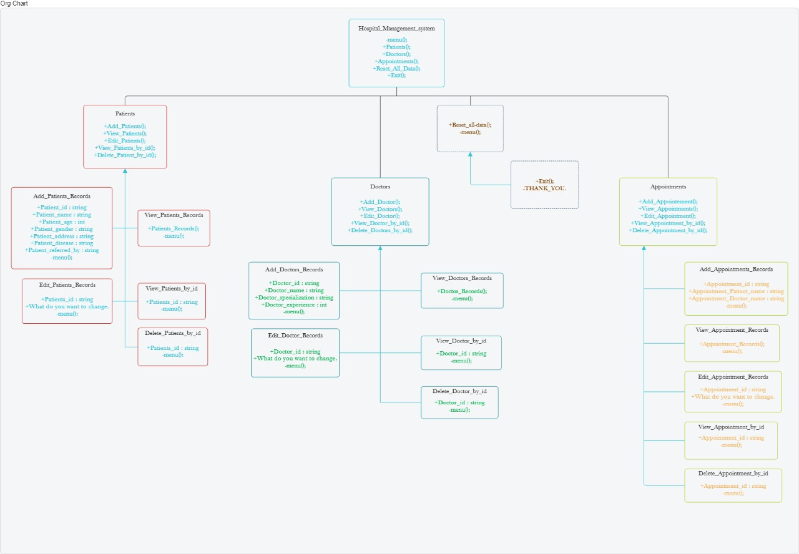

<h1 align="center"> 📸 Image Upload Guide</h1>

## Uploading an Image

To upload an image, follow these steps:

1. Click on the "Upload" button.
2. Select the image file from your device.
3. Click "Open" to upload the image.

Supported formats: JPEG, PNG, GIF.

Example:

## Contact 📞

For any questions or support, please contact [hemant0hack](mailto:hemant0hack@example.com).
